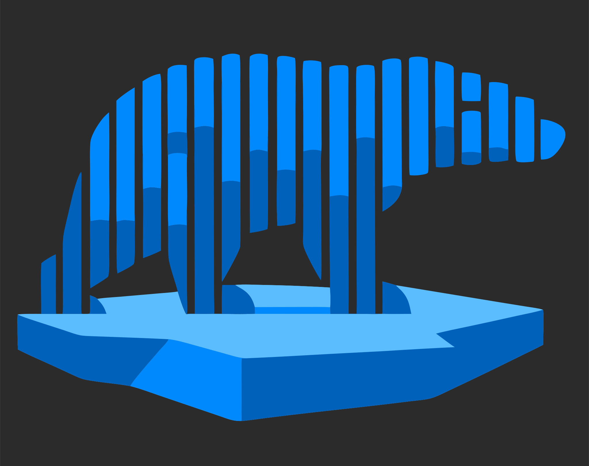

<h1 align="center">
    <a href="https://github.com/krzjoa/kra">
        
  </a>
</h1>

# kra

[](https://kra.readthedocs.io/en/latest/?badge=latest)
[](https://badge.fury.io/py/kra)
[](https://www.redbubble.com/i/sticker/kra-by-krzjoa/180671136/7sgk?asc=u)

A lightweight toolkit that extends [polars](https://pola-rs.github.io/polars/) with practical methods for cleaning data, standardizing schemas, encoding labels, and converting between common Python structures.


## Installation

Install kra from PyPI using pip:

```sh
pip install kra
```

To build and install a local version for development or testing:

```sh
pip install build
python -m build
pip install dist/kra-*.whl
```

This will build the wheel and install it into your current environment.


## Features

- **Polars-native extensions**: New methods on DataFrame/Series/Expr (for example `df.cols.*`, `df.drop_null_cols()`, `pl.col(...).label.encode()`).
- **Schema and column tools**: Fast bulk column renaming and validation (`to_snakecase`, `replace`, `has_all`, `rename` etc.).
- **Data cleaning helpers**: Utilities for null-column removal, conditional column selection, aggregation, and rounding.
- **Conversion utilities**: Easy conversion between DataFrames and dict-of-dicts, row-wise dicts, and array-like inputs.
- **Composable workflow style**: Designed to chain naturally with regular polars expressions and transformations.

---

## Example Use Cases

### 1. Clean and standardize an input table

```python
import polars as pl
import kra

df = pl.DataFrame({
    "User ID": [1, 2, 3],
    "Revenue": [12.349, 7.105, 9.999],
    "Unused": [None, None, None]
})

clean = (
    df
    .cols.to_snakecase()      # user_id, revenue, unused
    .drop_null_cols()         # remove null-typed columns
    .with_columns(pl.col("revenue").round(2))
    .select("user_id", kra.maybe_col("country", "unknown"), "revenue")
)
```

---

### 2. Encode labels and export keyed records

```python
import polars as pl
import kra

df = pl.DataFrame({
    "event_id": [101, 102, 103, 104],
    "event_type": ["click", "view", "click", "purchase"],
    "value": [1.0, 0.3, 0.8, 4.2]
})

enriched = df.with_columns(
    pl.col("event_type").label.encode().alias("event_type_id")
)

records = enriched.to_dod("event_id")
# {101: {'event_id': 101, 'event_type': 'click', 'value': 1.0, 'event_type_id': 0}, ...}
```

---

### 3. Build from dict-of-dicts and summarize

```python
import polars as pl
import kra

dod = {
    1: {"METRIC": "a", "V1": 10.0, "V2": 1.5},
    2: {"METRIC": "b", "V1": 20.0, "V2": 2.5},
    3: {"METRIC": "c", "V1": 30.0, "V2": 3.5},
}
df = kra.from_dod(dod, "id")

summary = (
    df
    .cols.to_lowercase()
    .agg(
        pl.col("v1").sum().alias("v1_total"),
        pl.col("v2").mean().alias("v2_avg")
    )
)
```
---

kra includes a Rust extension for fast label encoding, accessible via the Python API.


## Name

The name of the library, `kra` means **ice floe** in Polish.


## License

MIT License. See LICENSE for details.